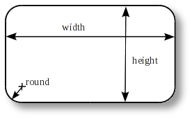
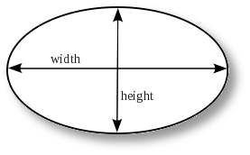
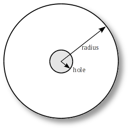
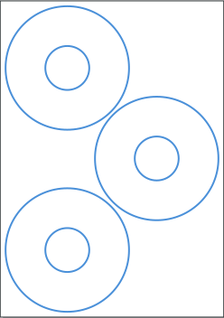
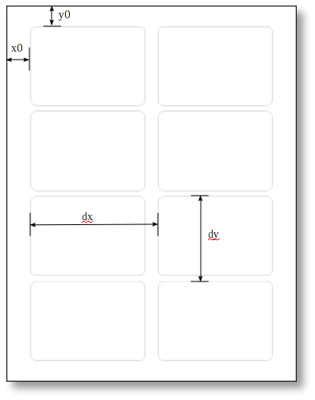

Manually Creating Product Templates
===================================

This document is a reference for manually creating *gLabels* product templates.

*gLabels* searches for templates in several locations as described here:</p>


Location                                  | Description
------------------------------------------|-----------------------------------------
${prefix}/share/glabels-qt/templates/     | Predefined templates distributed with glabels.
${XDG_CONFIG_HOME}/glabels.org/glabels-qt | User defined templates created with the gLabels Product Template Designer. **Do not place manually created templates here!**
${HOME}/.glabels                          | Manually created templates should be placed here.


Assumptions/caveats
-------------------

A sheet contains only one size of label or card (if a sheet contains more than one size of item,
it can be split into multiple templates for multiple pass printing).

Distances can be expressed in units of *pt*, *in1*, *mm*, *cm*, or *pc*.  For example:
`"1.0in"` or `"2.54cm"`.  If no units are specified, computer points (*pt*) will
be assumed (1 *pt* = 1/72 *in* = 0.352778 *mm*).


Template Files
--------------

A template file contains a single *Glabels-templates* top-level node.

```xml
<?xml version="1.0"?>
<Glabels-templates>

   ...one or more templates...

</Glabels-templates>
```

An example template file containing a single *Template* node:

```xml
<?xml version="1.0"?>
<Glabels-templates>

  <Template brand="Avery" part="8160" size="US-Letter" description="Mailing Labels">
    <Meta category="label"/>
    <Meta category="mail"/>
    <Label-rectangle id="0" width="189pt" height="72pt" round="5pt">
      <Markup-margin size="5pt"/>
      <Layout nx="3" ny="10" x0="11.25pt" y0="36pt" dx="200pt" dy="72pt"/>
    </Label-rectangle>
  </Template>

</Glabels-templates>
```

*Template* Node
---------------

A *Template* node describes a single stationery product.  It must contain exactly one instance of
a label node, either *Label-rectangle*, *Label-round*, *Label-ellipse* or *Label-cd*.

Property       | Description
---------------|------------
*brand*        | Brand or manufacturer of stationery product. E.g. "Avery".
*part*         | Part number or name of stationery product. E.g. "8160".
*size*         | Paper size.  Must match an ID defined in *paper-sizes.xml* or "Other".  E.g. "A4".
*description*  | Description of stationery product.  E.g, "Mailing Labels".
*_description* | Translatable description of stationery product. Used in predefined labels instead of description.
*width*        | Page width. Only valid if `size="Other"`.
*height*       | Page height. Only valid if `size="Other"`.
*equiv*        | Equivalent part number.  If this property is present, the template is a clone of another template of the same brand.  The template will inherit all properties, except brand and name from the other template. This equiv property must refer to a previously defined template - *gLabels* does not currently support forward references.

### Guidelines for Creating Product Descriptions

If creating templates to be distributed with *gLabels*, please use the following guidelines.

* If possible, Reuse the description of a similar product
* Only capitalize the first word of description
* Keep descriptions general
* Do not repeat the part number or name in the description


*Meta* Node
-----------

A *Meta* node contains some additional information about the template. A *Template* node may contain zero
or more *Meta* nodes.  Only one property should be defined per *Meta* node.

Property      | Description
--------------|------------
*category*    | A category for the template. A template can belong to multiple categories by simply adding multiple *Meta* nodes to the parent *Template* node. The category must match an existing ID defined in categories.xml.  E.g. `category="media"`
*product_url* | A URL pointing to the vendor's webpage for the specific product, if available.


*Label-rectangle* Node
----------------------

A *Label-rectangle* node describes the dimensions of a single label or business card that is rectangular
in shape (may have rounded edges).

Property      | Description
--------------|------------
*id*          | Reserved for future use.  Should always be 0.
*width*       | Width of label or card. E.g. `width="29mm"`
*height*      | Height of label or card. E.g. `height="100mm"`
*round*       | Radius of corners.  For items with square edges (business cards), the radius should be 0.
*x_waste*     | Amount of horizontal waste (over-print) to allow.  This is useful for minimizing alignment problems when using non-white backgrounds (e.g. images).
*y_waste*     | Amount of vertical waste (over-print) to allow.




*Label-ellipse* Node
--------------------

A *Label-ellipse* node describes the dimensions of a single label or business card that is elliptical
in shape.

Property      | Description
--------------|------------
*id*          | Reserved for future use.  Should always be 0.
*width*       | Width of label or card. E.g. `width="29mm"`
*height*      | Height of label or card. E.g. `height="100mm"`
*waste*       | Amount of waste (over-print) to allow.  This is useful for minimizing alignment problems when using non-white backgrounds (e.g. images).




*Label-round* Node
------------------

A *Label-round* node describes the dimensions of a simple round label (not a CD).

Property      | Description
--------------|------------
*id*          | Reserved for future use.  Should always be 0.
*radius*      | Radius (1/2 diameter) of label or card. E.g. `radius="14.5mm"`
*waste*       | Amount of waste (over-print) to allow.  This is useful for minimizing alignment problems when using non-white backgrounds (e.g. images).


*Label-cd* Node
---------------

A *Label-cd* node describes the dimensions of a CD, DVD, or business card CD.

Property      | Description
--------------|------------
*id*          | Reserved for future use.  Should always be 0.
*radius*      | Outer radius (1/2 diameter) of label. E.g. `radius="58.5mm"`
*hole*        | Radius (1/2 diameter) of concentric hole. E.g. `hole="18mm"`
*width*       | If present, the label is clipped to the given Width. (For use with business card CDs.)
*height*      | If present, the label is clipped to the given height. (For use with business card CDs.)
*waste*       | Amount of waste (over-print) to allow.  This is useful for minimizing alignment problems when using non-white backgrounds (e.g. images).




*Markup* Nodes
--------------

Templates may contain optional markup nodes.  These nodes are used to describe
a simple set of markup lines that are visible in the *glabels* drawing canvas, but
not visible when printed.  These lines can represent margins, fold lines, center lines,
special areas, or other helpful hints to the user of a template.


### *Markup-margin* Node

A *Markup-margin* describes a margin along all edges of a label.

Property      | Description
--------------|------------
*size*        | Size of the margin.  I.e. the distance of the margin line from the edge of the card/label.


### *Markup-line* Node

A *Markup-line* node describes a markup line.

Property      | Description
--------------|------------
*x1*          | X coordinate of 1st endpoint of the line segment.
*y1*          | Y coordinate of 1st endpoint of the line segment.
*x2*          | X coordinate of 2nd endpoint of the line segment.
*y2*          | Y coordinate of 2nd endpoint of the line segment.


### *Markup-circle* Node

A *Markup-circle* describes a markup circle.

Property      | Description
--------------|------------
*x0*          | X coordinate of circle origin (center).
*y0*          | Y coordinate of circle origin (center).
*radius*      | Radius of circle.


### *Markup-rect* Node

A *Markup-rect* describes a markup rectangle.

Property      | Description
--------------|------------
*x1*          | X coordinate of upper left corner of rectangle.
*y1*          | Y coordinate of upper left corner of rectangle.
*w*           | Width of rectangle.
*h*           | Height of rectangle.
*r*           | Radius of rounded corners of rectangle.


### *Markup-ellipse* Node

A *Markup-ellipse* describes a markup ellipse.

Property      | Description
--------------|------------
*x1*          | X coordinate of upper left corner of ellipse bounding box.
*y1*          | Y coordinate of upper left corner of ellipse bounding box.
*w*           | Width of ellipse.
*h*           | Height of ellipse.


*Layout* Node
-------------

A label node may contain multiple *Layout* children.  If labels are arranged in a simple grid pattern, only
one layout is needed.  However, if labels are arranged in multiple grids, such as a running bond pattern,
multiple *Layout* tags can be used.

A common example for multiple layouts is a sheet with three CD labels:



The two labels on the left edge can be assigned to a grid, assuming we
can define the coordinates for the top left label and the distance to
the second label properly. The distance to the left edge is common to
these labels. The third one on the right edge has no common distance
values with the other ones, that's why we have to define a second layout,
with unique coordinates for the top left corner of that label.

> You can define multiple layouts only if the labels on the sheet
> have the same shape. If your sheet contains different shapes, you have
> to define each shape in another template separately. Future versions
> of <app>gLabels</app> will probably be able to concatenate such sheets
> with different shapes within a single template.</p>

> A single label can always be treated as a grid of one.

Property      | Description
--------------|------------
*nx*          | Number of labels/cards in the grid in the X direction (horizontal).
*ny*          | Number of labels/cards in the grid in the Y direction (vertical).
*x0*          | Distance from left edge of sheet to the left edge of the left column of cards/labels in the layout.
*y0*          | Distance from the top edge of sheet to the top edge of the top row of labels/cards in the layout.
*dx*          | Horizontal pitch of grid.
*dy*          | Vertical pitch of grid.


